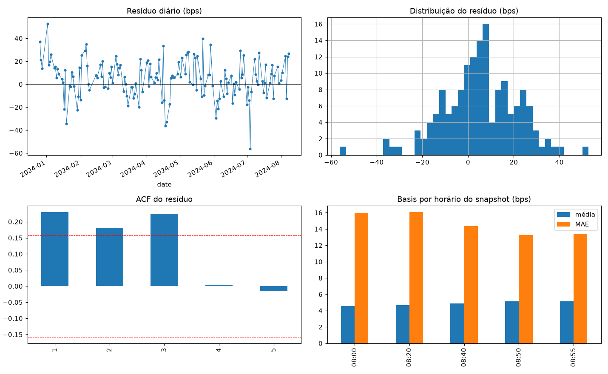

# USDBRL Open Nowcast

**Pre-market nowcasting of the USDBRL spot opening price (9:00 BRT) from CME futures, with a leakage-free, point-in-time pipeline and honest walk-forward validation.**

A trader needs an estimate of the USDBRL opening price *before* the onshore market opens.
The key insight — reached through a structured "expert debate" exercise documented in
[docs/debate_transcript.md](docs/debate_transcript.md) (in Portuguese) — is that this is
**not a forecasting problem, it is a nowcast**: the CME BRL/USD future (6L) trades ~23h/day,
so by 8:50 BRT the market has already priced the overnight. The arbitrage-free implied spot is

```
cupom  C_C   = ((1 + selic) / (1 + us_1m)) ^ (bd/252)        # covered interest parity
dolar_cc     = (100 / 6L_price) / C_C                        # implied USDBRL spot
```

The model therefore predicts only the **residual** the futures market does *not* price:

```
y = log(open_9:00) − log(dolar_cc_8:50)          # mean +5.1 bps, sd 16.3 bps
```

## Why this project is interesting

1. **Leakage-proof by design.** Financial ML fails silently through lookahead: contemporaneous
   targets, shuffled time-series splits, preprocessing fitted on the full dataset, macro joined
   by reference date instead of publication date, naive timezone shifts. Each of these classic
   pitfalls is engineered against explicitly — the debate opens with the full checklist and the
   dataset builder ships automated anti-leakage asserts.
2. **Point-in-time discipline everywhere.** One row per trading day, features frozen at the
   8:50 BRT snapshot, macro joined by *publication timestamp* (`data/reference/macro_releases.csv`),
   and the US rate entering the carry formula with its real 1-day publication lag (vintage
   audit: max impact 0.5 bp).
3. **Honest validation, honest verdict.** Expanding walk-forward (60d initial, 5d step, 2d embargo),
   two mandatory benchmarks, Diebold-Mariano tests, a feature-ablation study, and a registry of
   every configuration tried (a brake against backtest overfitting). The headline model **fails**
   the strict go/no-go — and the README says so.

## Results (91 out-of-sample predictions)

| Config | MAE (bps) | Directional hit rate (actionable days) |
|---|---|---|
| b1: open = dolar_cc | 13.54 | — |
| b2: dolar_cc + 20d rolling basis | 13.68 | 42% (12 days) |
| **Ridge, 5 real-time features** | **12.58** | **76% (29 days)** |
| Ridge + USDT/BRL block | 13.09 | 70% (27 days) |



**Verdict: formal NO-GO** under the pre-registered criteria (MAE improvement +8% < 15% required;
DM p = 0.19; instability across halves — N is simply too small). What survives:

- `dolar_cc @ 8:50` + its mean basis (+5 bps) as the point estimate;
- a **regime classifier** — P(|basis| > cost) — telling the trader whether the futures-implied
  price is reliable *today*;
- the ridge **directional signal** (76% on actionable days) — promising but fragile at N=29,
  so it runs in logged paper trading (`src/predict_premarket.py`) rather than in production.

Two side findings: the crypto proxy (USDT/BRL overnight) **failed** both a 3-step predictive
test and the ablation (+4.1% MAE) and was excluded; quarterly real GDP was added to the dataset
by publication date but only as part of an aggregate event-day dummy — 2–3 releases in the
sample window cannot support a continuous feature.

## Repository layout

```
src/
  build_dataset.py       # raw ticks -> daily point-in-time dataset (anti-leakage asserts)
  diagnostics.py         # residual EDA, snapshot-time selection, USDT 3-step test, stop-gate
  validate.py            # walk-forward, benchmarks, Diebold-Mariano, ablation, go/no-go
  train.py               # final ridge + regime classifier (block-bootstrap CIs)
  predict_premarket.py   # daily trader tool (~8:50 BRT), logs every prediction
data/
  reference/             # curated macro release calendar (publication timestamps), rate gap-fill
  processed/             # dataset_daily.csv (154 rows, Dec 2023 - Aug 2024)
  raw/                   # NOT versioned - licensed tick data (see data/README.md)
results/                 # walk-forward outputs, diagnostics, config registry
models/                  # ridge + regime classifier artifacts
docs/debate_transcript.md  # the 2-round expert debate that produced the spec (PT-BR)
notebooks/report.ipynb   # consolidated report
```

## Running it

```bash
pip install -r requirements.txt

# Full pipeline needs the raw tick data (licensed, not in the repo — see data/README.md):
export USDBRL_RAW_CONTRACTS=/path/to/monthly_6L_contracts
export USDBRL_RAW_MARKET=/path/to/market_csvs
python src/build_dataset.py

# From the committed processed dataset, everything else reproduces the published results:
python src/diagnostics.py
python src/validate.py
python src/train.py
python src/predict_premarket.py --dry-run
```

Daily use at ~8:50 BRT (all inputs observable in real time before the open):

```bash
python src/predict_premarket.py --fut 18.40 --fut-prev 18.45 --dxy 103.2 --dxy-prev 103.0 \
       --selic 15.0 --us-rate 5.3 --du 15 --event 0
```

## Disclaimers

- Raw Bloomberg/terminal tick data is licensed and cannot be redistributed; only small,
  heavily derived daily aggregates are committed.
- Company- and counterparty-specific references were removed from the documents.
- This is a research/portfolio project, not investment advice.
