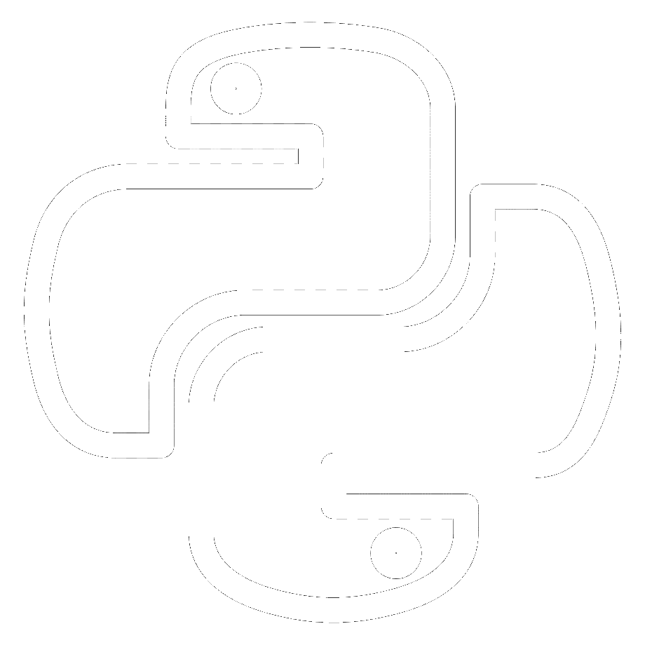

# Portfolio

<h1 align="center">Thiago Laidler</h1>
<table>
  <tbody>
    <tr>
      <td><b>Information</b></td>
      <td width="50%" rowspan="4">
        
      </td>
    </tr>
    <tr>
      <td>
        <ul>
         <li>Bacharel em Astronomia/Astrofísica pela Universidade Federal do Rio de Janeiro (UFRJ)</li>
          <li>thiagolaidler@gmail.com</li>
         <li><a href="https://www.linkedin.com/in/thiago-laidler">Perfil Linkedin</a></li>
        </ul>
      </td>
    </tr>
   <tr><td><b>Principais Skills.</b></td></tr>
    <tr>
      <td>
        <ul>
          <li>
             Python
          </li>
          <li>
             SQL
          </li>
          <li>
             Excel
          </li>
          <li>
             Estatística
          </li>
        </ul>
      </td>
    </tr>
    <tr><td><b>Detalhes</b></td></tr>
    <tr>
      <td width="50%">
        <ul>
          <li><a href="./pdfs/TL_CDJunior.pdf">Curriculo em pdf</a></li>
        </ul>
      </td>
    </tr>
   <tr><td><b>Todos os projetos podem ser encontrados nas pastas deste repositório.</b></td></tr>
  </tbody>
</table>
